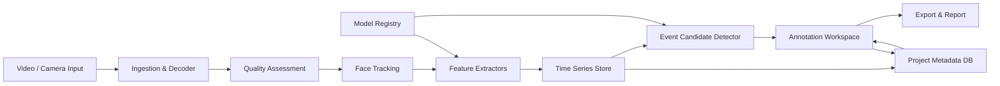

# FaceCat 技术、理论支撑与可扩展架构设计

研究日期：2026-05-23  
适用阶段：MVP 到可扩展产品架构  
关联文档：`docs/micro-expression-market-opportunity.md`
优化评审：`docs/architecture-optimization-review.md`
成本与技术栈：`docs/cost-and-tech-stack.md`

## 1. 核心判断

FaceCat 的技术路线应建立在一个前提上：**先测量可观察的面部行为，再辅助人类解释，不直接声称识别真实情绪或谎言**。

因此，技术架构不应围绕“情绪分类器”设计，而应围绕“面部行为数据管线”设计：

> 视频输入 -> 质量评估 -> 人脸跟踪 -> 几何/外观/运动特征 -> AU 或 blendshape 时间序列 -> 短时事件候选 -> 人工复核 -> 导出与报告。

这个方案具备可实操性。第一版可以用成熟模型和规则检测完成闭环，后续再逐步替换更强模型、加入多模态数据、做 SDK 或私有化部署。

## 2. 理论支撑

### 2.1 FACS 与 Action Units

FaceCat 最稳的理论基础不是“情绪识别”，而是 FACS，即 Facial Action Coding System。FACS 关注面部肌肉动作单元，例如：

- AU1：Inner Brow Raiser
- AU2：Outer Brow Raiser
- AU4：Brow Lowerer
- AU6：Cheek Raiser
- AU12：Lip Corner Puller
- AU15：Lip Corner Depressor

AU 是对可观察面部动作的编码，比“高兴、愤怒、悲伤”等情绪标签更可解释，也更适合和视频帧证据对应。

产品上应把 AU 作为一等公民：

- 每个 AU 有帧级强度。
- 每个 AU 变化能回放到视频。
- 每个候选事件由 AU、关键点、头姿、质量指标共同解释。
- 情绪标签最多作为用户自定义解释层，不作为系统默认结论。

### 2.2 微表情的时序结构

微表情或短时面部变化通常可以拆成三个阶段：

- onset：动作开始出现。
- apex：动作峰值。
- offset：动作回落。

FaceCat 的关键能力不是直接分类“这是什么情绪”，而是帮助用户更快找到并校准这三个时间点。

技术上可以先把“微表情识别”拆成两个问题：

1. Spotting：视频里哪里出现了短时面部变化。
2. Recognition：这个变化应该如何命名或解释。

MVP 应优先做 spotting 和人工辅助标注。Recognition 可以后置，因为它对数据集、标签体系和场景依赖更强。

### 2.3 信号处理视角

面部行为分析本质是多条时间序列的变化检测。可用信号包括：

- AU 强度曲线。
- 关键点位移。
- 局部 ROI 运动。
- 光流变化。
- 头姿 yaw/pitch/roll。
- 眨眼和眼睑运动。
- 人脸质量、遮挡和置信度。

第一版可以用可解释的信号处理方法：

- 滑动窗口平滑。
- 一阶/二阶差分。
- Z-score 或 per-subject baseline。
- 峰值检测。
- 变化点检测。
- 最小持续时间和最大持续时间约束。
- 头姿和质量门控。

这比一开始训练复杂深度模型更实用，因为它可解释、可调参、便于和用户一起校准。

### 2.4 人在回路

微表情标注存在主观性，完全自动化很难让研究者信任。FaceCat 应默认 human-in-the-loop：

- 系统给候选片段，不给最终真理。
- 用户能修改 onset/apex/offset。
- 用户能覆盖标签。
- 所有模型输出和人工修改都保留版本。
- 报告区分“自动候选”和“人工确认”。

这不仅是产品策略，也是理论上的必要设计。

### 2.5 测量边界

FaceCat 可以可靠承诺的是：

- 检测视频中的面部运动和变化。
- 提供 AU/关键点/头姿等可观察特征。
- 帮助用户发现和标注短时事件。
- 输出质量、置信度和证据链。

FaceCat 不应承诺：

- 判断真实情绪。
- 判断是否撒谎。
- 判断心理状态或人格。
- 在无人工复核下对个人做高风险决策。

## 3. 技术路线分层

建议把能力拆成四层，从稳定到不稳定逐步推进。

| 层级 | 名称 | 目标 | MVP 是否需要 |
|---|---|---|---|
| L0 | 视频与质量层 | 解码、抽帧、脸部质量、帧率、模糊、遮挡 | 必须 |
| L1 | 可观察特征层 | landmarks、head pose、gaze、AU/blendshape | 必须 |
| L2 | 事件候选层 | spotting、onset/apex/offset 候选 | 必须 |
| L3 | 解释与标签层 | AU 组合、用户标签、弱情绪解释 | 部分需要 |
| L4 | 场景洞察层 | UX/广告/医疗等场景报告 | 暂缓 |

第一版只要把 L0-L2 做扎实，再提供轻量 L3 人工标签，就能形成闭环。

## 4. 总体架构

建议采用“桌面壳 + 前端 UI + 本地分析引擎 + 版本化数据层”的架构。



### 4.1 推荐技术栈

MVP 推荐：

- UI：React + TypeScript。
- 桌面壳：Tauri 或 Electron。更看重轻量和本地安全时选 Tauri；更看重生态和开发速度时选 Electron。
- 分析引擎：Python。
- 本地服务通信：HTTP/WebSocket 或 gRPC。MVP 可用 FastAPI + WebSocket。
- 视频处理：FFmpeg / OpenCV。
- 特征 baseline：MediaPipe、OpenFace、Py-Feat、LibreFace 中选择 1-2 个先跑通。
- 数据库：SQLite 存项目元数据。
- 时间序列文件：Parquet/Arrow 或分片 JSON/CSV。MVP 可先 CSV/JSON，尽早抽象存储接口。
- 报告：HTML/PDF 模板。

不建议 MVP 直接做纯浏览器端全量推理。WebGPU/WASM 有价值，但会增加兼容性成本。更务实的顺序是：先 Python 本地引擎跑通，后续把可端侧化的模块迁到 WebGPU/WASM 或移动端。

### 4.2 未来可扩展形态

同一套核心引擎应能支持四种产品形态：

1. 桌面工作台：研究者和 UX 团队使用。
2. CLI 批处理：实验室批量跑视频。
3. 本地 SDK：医疗、车载、机器人等集成。
4. 私有化服务：企业内网部署，前端多人协作。

为了支持这些形态，核心原则是：

- UI 不能直接调用具体模型，只调用分析任务 API。
- 模型不能直接写 UI 状态，只输出标准化 feature/event 数据。
- 数据格式必须版本化。
- 每次分析必须记录模型版本、参数、输入视频哈希和运行时间。

## 5. 模块设计

### 5.1 Ingestion & Decoder

职责：

- 导入视频。
- 读取元数据：fps、分辨率、编码、时长、音轨。
- 抽帧或按需解码。
- 生成视频哈希，避免重复分析。

未来扩展：

- 摄像头实时流。
- 批量导入。
- 云端对象存储。
- 多机处理。

### 5.2 Quality Assessment

职责：

- 判断视频是否适合分析。
- 输出帧级和片段级质量指标。

指标建议：

- face detected confidence。
- face box size ratio。
- blur score。
- brightness/contrast。
- occlusion proxy。
- head pose extreme angle。
- frame drop / unstable fps。
- compression artifact proxy。

产品规则：

- 质量不过关时，不应强行输出高置信事件。
- 报告中必须包含质量说明。
- 低质量片段应在时间线上高亮。

### 5.3 Face Tracking

职责：

- 多人脸检测。
- 跨帧 track id。
- 丢失恢复。
- 主体选择。

MVP 可以先限制单人脸视频，但数据结构必须支持多人脸：

- `track_id`
- `frame_index`
- `bbox`
- `landmarks`
- `confidence`

这样未来做访谈、会议、课堂、多人广告测试时不用重构。

### 5.4 Feature Extractors

职责：

- 输出标准化可观察特征。
- 屏蔽不同底层模型差异。

建议定义适配器接口：

```ts
interface FeatureExtractor {
  id: string;
  version: string;
  capabilities: string[];
  extract(input: FrameBatch): Promise<FeatureBatch>;
}
```

可插拔 extractor：

- LandmarkExtractor
- HeadPoseExtractor
- GazeExtractor
- AUExtractor
- BlendshapeExtractor
- OpticalFlowExtractor
- AudioProsodyExtractor

MVP 先实现 landmark/head pose/blendshape 或 AU。接口先定好，未来替换模型不影响 UI。

### 5.5 Time Series Store

职责：

- 保存帧级特征。
- 支持快速读取某个时间段。
- 支持曲线可视化。
- 支持导出。

建议数据形态：

- SQLite：项目、视频、运行、标注、事件元数据。
- Parquet/Arrow：大规模帧级时间序列。
- 文件系统：原始视频、缩略图、片段导出、报告。

MVP 如果用 CSV/JSON，也要通过 `FeatureStore` 接口访问，避免 UI 绑定文件格式。

### 5.6 Event Candidate Detector

职责：

- 根据特征时间序列生成候选短时事件。
- 给出 onset/apex/offset、置信度、触发原因。

第一版建议规则和信号处理优先：

- 对 AU 或 blendshape 曲线做平滑。
- 计算局部 baseline。
- 检测短时间内的显著上升和回落。
- 过滤头部大幅运动、眨眼、低质量帧。
- 合并相邻候选。
- 输出触发特征和曲线截图。

事件数据示例：

```json
{
  "event_id": "evt_001",
  "track_id": "face_1",
  "onset_ms": 12340,
  "apex_ms": 12480,
  "offset_ms": 12620,
  "confidence": 0.72,
  "source": "rule_change_point_v1",
  "trigger_features": ["AU12", "AU6", "mouthSmileLeft"],
  "quality_flags": ["stable_head_pose"],
  "status": "candidate"
}
```

未来可以加入：

- TCN/Transformer spotting 模型。
- 光流/局部纹理模型。
- 主动学习模型。
- 用户项目内校准模型。

但无论模型多复杂，都应输出同样的事件 schema。

### 5.7 Annotation Workspace

职责：

- 视频逐帧查看。
- 时间线缩放。
- 曲线和事件联动。
- 调整 onset/apex/offset。
- 打标签。
- 标注版本管理。

关键原则：

- 自动候选和人工确认分开显示。
- 每次修改保留审计记录。
- 支持 uncertain 标签。
- 支持用户自定义标签体系。

未来扩展：

- 多标注者。
- 标注一致性 Cohen's kappa / Krippendorff's alpha。
- 盲标模式。
- 争议片段仲裁。

### 5.8 Export & Report

职责：

- 导出结构化数据。
- 生成可读报告。
- 让用户能进入已有研究流程。

MVP 导出：

- CSV：帧级特征和事件表。
- JSON：完整项目和事件数据。
- HTML/PDF：报告。
- Clips：候选事件小片段。

未来导出：

- ELAN。
- BORIS。
- Praat TextGrid。
- Jupyter notebook。
- API webhook。

报告应区分：

- 自动检测结果。
- 人工确认结果。
- 质量限制。
- 模型版本和参数。
- 不适用声明。

## 6. 数据模型建议

### 6.1 核心实体

| 实体 | 说明 |
|---|---|
| Project | 一个研究或用户测试项目 |
| VideoAsset | 原始视频资产 |
| AnalysisRun | 一次分析运行，记录模型版本和参数 |
| FaceTrack | 一个被跟踪的人脸轨迹 |
| FrameObservation | 单帧检测结果 |
| FeatureSeries | AU、landmark、head pose 等时间序列 |
| EventCandidate | 系统生成的候选事件 |
| Annotation | 用户确认或修改后的标注 |
| LabelSchema | 标签体系，例如 FACS、自定义 UX 标签 |
| ExportJob | 导出任务 |
| Report | 报告结果 |

### 6.2 版本化原则

所有输出都必须回答四个问题：

1. 来自哪个视频？
2. 用哪个模型和参数生成？
3. 是自动生成还是人工确认？
4. 质量和置信度如何？

如果这四点不清楚，后续就无法做科研复现、客户审计或模型迭代。

## 7. 算法路线图

### 7.1 MVP 算法

优先选择可解释 baseline：

- MediaPipe Face Landmarker 获取 landmarks、blendshapes、head pose。
- OpenFace 或 Py-Feat 获取 AU baseline。
- 使用规则检测短时变化：
  - 曲线平滑。
  - baseline normalize。
  - peak detection。
  - duration filter。
  - quality gate。

目标不是 SOTA，而是建立端到端闭环。

### 7.2 V1 算法增强

在拿到真实用户数据后再做：

- per-user calibration。
- 光流和局部 ROI motion。
- AU 组合规则。
- 候选事件排序模型。
- 主动学习：用户确认/拒绝反哺模型。
- 低质量场景错误案例库。

### 7.3 V2 算法增强

当数据积累足够后再考虑：

- 微表情 spotting 深度模型。
- 跨数据集 domain adaptation。
- 多模态同步：音频韵律、文本、眼动、EDA。
- 场景模型：UX、广告、康复训练等。
- 端侧模型压缩和 WebGPU/WASM。

## 8. 工程路线图

### 8.1 第一个可运行原型

目标：证明“导入视频 -> 特征曲线 -> 候选事件 -> 人工标注 -> 导出”能跑通。

建议实现：

- Python CLI：`facecat analyze input.mp4 --out project_dir`
- 输出：
  - `metadata.json`
  - `features.csv`
  - `events.json`
  - `thumbnails/`
- 简单 Web UI 读取这些文件并展示。

这个阶段不需要复杂数据库，先把数据 schema 定稳。

### 8.2 MVP 产品化

目标：普通研究者可以安装和使用。

建议实现：

- 桌面 App。
- 本地分析队列。
- SQLite 项目库。
- 时间线 UI。
- 标注保存。
- 报告导出。

### 8.3 V1 可扩展化

目标：支持团队、批量和私有化。

建议实现：

- Analysis Engine 独立进程。
- 插件式模型适配器。
- 批处理任务队列。
- 统一 FeatureStore。
- 项目压缩包格式 `.facecatproj`。
- 模型版本注册表。

### 8.4 V2 平台化

目标：支持 SDK、企业部署和多模态。

建议实现：

- 本地 SDK。
- Headless server。
- REST/gRPC API。
- 多用户权限。
- 对象存储。
- 多模态时间轴。
- 数据集和评测模块。

## 9. 架构风险与规避

| 风险 | 规避方式 |
|---|---|
| UI 和模型耦合 | 从第一天定义分析 API 和标准数据 schema |
| 早期 CSV 写死 | 用 FeatureStore 接口包起来 |
| 模型替换困难 | 所有模型通过 adapter 注册 |
| 用户不信任结果 | 每个事件保留触发曲线、帧证据、质量指标 |
| 误报过多 | 候选召回优先，但提供排序、过滤、人工确认 |
| 后续多脸场景重构 | MVP 可限制单脸，但 schema 支持 track_id |
| 无法科研复现 | AnalysisRun 记录模型版本、参数、输入哈希 |
| 合规风险 | 默认本地处理，报告声明边界，不做身份识别 |
| 性能瓶颈 | 分析引擎异步任务化，帧级特征列式存储 |

## 10. 推荐架构决策

建议现在就确定的决策：

1. 产品定位：AI 辅助面部行为标注工具，不是情绪判断工具。
2. 输出对象：AU/landmark/head pose/quality/event，而不是 emotion label。
3. 数据结构：所有结果必须绑定 `video_id`、`track_id`、`analysis_run_id`。
4. 引擎边界：Python analysis engine 和前端 UI 分离。
5. 模型边界：所有模型通过 adapter 接口接入。
6. 存储边界：元数据和帧级特征分开存。
7. 人工复核：Annotation 是一等实体，不覆盖自动候选。
8. 报告边界：报告必须显示模型版本、质量限制和人工确认状态。

暂缓的决策：

- 是否做云端 SaaS。
- 是否做实时摄像头分析。
- 是否训练自有深度模型。
- 是否做情绪类别预测。
- 是否做移动端 SDK。

这些都应等 MVP 真实用户反馈后再决定。

## 11. 最小技术闭环

如果只做一个 2-3 周原型，最小闭环应是：

1. Python 读取视频并抽帧。
2. MediaPipe 或 OpenFace 提取帧级特征。
3. 输出统一 `features.csv`。
4. 用规则检测候选事件，输出 `events.json`。
5. 前端展示视频、曲线和事件区间。
6. 用户能调整事件边界和标签。
7. 导出修正后的事件表。

这个闭环能验证三个关键假设：

- 自动特征是否足够稳定。
- 候选事件是否能减少人工搜片段时间。
- 用户是否愿意围绕时间线和证据链工作。

## 12. 最终建议

FaceCat 的架构要服务于长期演进，但第一版不能过度工程化。最优策略是：

> 用模块化边界做一个很小的工作台，而不是用临时代码做一个很大的 demo。

具体来说，MVP 可以很轻，但以下四件事不能省：

- 标准化数据 schema。
- AnalysisRun 版本记录。
- 模型 adapter 边界。
- 自动候选与人工标注分离。

只要这四件事做好，未来从桌面工具扩到 SDK、批处理、私有化、多模态或自研模型，都不会推倒重来。
